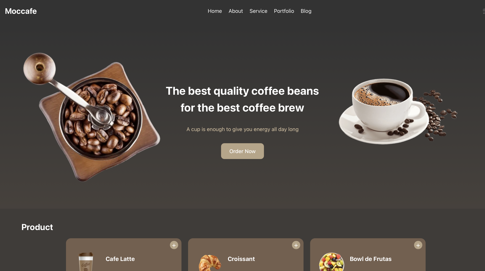

# 🌐 Frontend - Moccafe

## 📌 Descripción del Proyecto
Este es el **frontend** de la aplicación **Moccafe**, una plataforma interactiva para la gestión de pedidos de una cafetería. El sistema está desarrollado en **React**, proporcionando una experiencia de usuario fluida, dinámica y moderna.

## 🏗️ Estructura del Proyecto
La estructura del frontend sigue una organización modular para mejorar la escalabilidad y mantenibilidad:

```
Front/
│
├── src/
│   ├── components/          # Componentes reutilizables
│   │   ├── ProductList.js   # Listado de productos con selección interactiva
│   ├── assets/              # Imágenes y recursos estáticos
│   ├── App.js               # Componente principal de la aplicación
│   ├── index.js             # Punto de entrada de la aplicación
├── public/                  # Archivos estáticos accesibles desde el navegador
├── package.json             # Configuración del proyecto y dependencias
├── README.md                # Documentación del proyecto
```

## 📦 Dependencias Utilizadas
Este proyecto utiliza las siguientes dependencias definidas en `package.json`:

```json
{
  "dependencies": {
    "react": "^18.2.0",
    "react-dom": "^18.2.0"
  }
}
```

## ⚙️ Instrucciones de Instalación
1. **Clonar el repositorio:**
   ```sh
   git clone https://github.com/Arqui-de-Software/Front.git
   cd Front
   ```

2. **Instalar dependencias:**
   ```sh
   npm install
   ```

3. **Ejecutar el proyecto:**
   ```sh
   npm start
   ```

Esto iniciará el servidor de desarrollo en `http://localhost:3000/`.

## 🎨 Interfaz de Usuario
El frontend presenta un diseño moderno y atractivo con las siguientes características:
- **Navbar dinámica** con opciones de navegación.
- **Sección de productos** con visualización de imágenes y precios.
- **Interacción de usuario** con selección de productos y detalles emergentes.

## 🛠️ Componentes Clave
### `App.js`
- Renderiza la interfaz principal incluyendo la barra de navegación y la lista de productos.

### `ProductList.js`
- Muestra los productos disponibles con imágenes y precios.
- Permite seleccionar productos y ver detalles emergentes.

## 🖼️ Ejemplo de Interfaz


## 🔗 Backend del Proyecto
Este frontend se conecta con un backend basado en **Node.js y Express**, disponible en el siguiente repositorio:

🔗 [Backend Repository](https://github.com/Arqui-de-Software/Back.git)

## 🤝 Contribuciones
Este proyecto fue desarrollado por:
- 👩‍💻 Rita Trindade da Cruz
- 👨‍💻 Juan Andrés Gómez Pérez
- 👨‍💻 Brandon Eduardo Merchan

